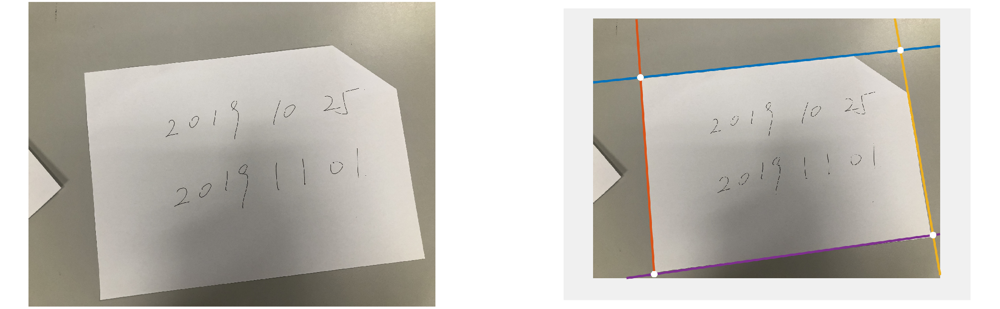
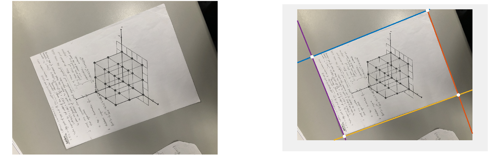
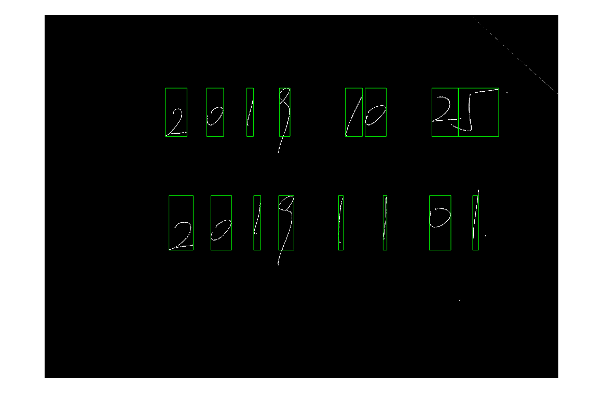

# image-processing
HKUST 2019-2020 Fall COMP4421

## Assignment 1
1. Linear spatial filtering
    - mean, gradient, laplacian filtering
2. Non-linear spatial filtering
    - noise generation (gaussian, salt and pepper)
    - median filtering
    - frequency domain filtering (low pass, high pass, high-frequency emphasis)

## Assignment 2
1. Connected components
2. Hough transform
    - detect syntheic circles
    - detect 4 edges and corners

## Assignment 3
1. Image warping
2. Digit Segmentation

## Assignment 4
Face recognition

Identify faces in 32x32 processed extended Yale Face Dataset B 
Use Local Ternary Pattern and preprocess chain proposed in the paper "Enhanced local texture feature sets for face recognition under difficult lighting conditions"

Number of subjects: 38 
Total test images: 2376 
Overall recognition rates: 89.646465%  

Reference:
- X. Tan, B. Triggs, "Enhanced local texture feature sets for face recognition under difficult lighting conditions", IEEE Trans. Image Process., vol. 19, no. 6, pp. 1635-1650, Jun. 2010.
- A. Georghiades, P. Belhumeur, D. Kriegman, "From Few to Many: Illumination Cone Models for Face Recognition under Variable Lighting and Pose", IEEE Trans. Pattern Analysis and Machine Intelligence, vol. 23, no. 6, pp. 643-660, June 2001.
- The processed Extended Yale Face Database B, http://www.cad.zju.edu.cn/home/dengcai/Data/FaceData.html