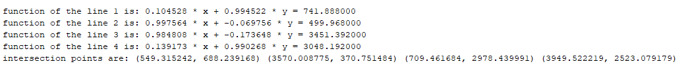
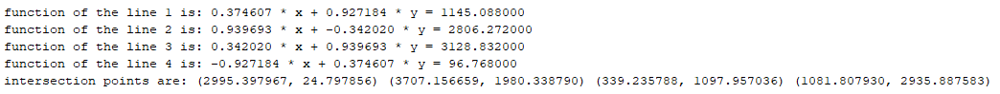
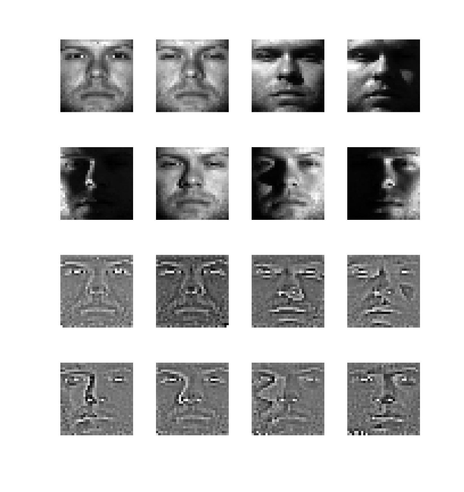

# Image Processing
HKUST 2019-2020 Fall COMP4421

## Assignment 1
1. Linear spatial filtering
    - mean, gradient, laplacian filtering
2. Non-linear spatial filtering
    - noise generation (gaussian, salt and pepper)
    - median filtering
    - frequency domain filtering (low pass, high pass, high-frequency emphasis)

## Assignment 2
1. Connected components
2. Hough transform
    - detect syntheic circles
    - detect four sides of an A4 paper

| A4 paper detection output                  |
| :----------------------------------------: |
|  |
|  |

## Assignment 3
1. Image warping
2. Digit Segmentation

<table>
  <tr>
    <th colspan="2">Digit segmentation output</th>
  </tr>
  <tr>
    <th>Input image</th>
    <th>Progress</th>
  </tr>
  <tr>
    <td align="center">
      
    </td>
    <td align="center">
      
    </td>
  </tr>
  <tr>
    <th colspan="2">Output</th>
  </tr>
  <tr>
  <tr>
    <td colspan="2" align="center">
      
    </td>
  </tr>
</table>

## Assignment 4
Face recognition

Identify faces in 32x32 processed extended Yale Face Dataset B 
Use Local Ternary Pattern and preprocess chain proposed in the paper "Enhanced local texture feature sets for face recognition under difficult lighting conditions"

| Image samples before and after preprocessing     |
| :----------------------------------------------: |
|  |

<table>
  <tr>
    <th colspan="6">Overall recognition rates</th>
  </tr>
  <tr>
    <td colspan="5" align="center">Subset No. (number of probes)</td>
    <td rowspan="2" align="center">Total (2376)</td>
  </tr>
  <tr>
    <td align="center">1 (301)</td>
    <td align="center">2 (342)</td>
    <td align="center">3 (493)</td>
    <td align="center">4 (526)</td>    
    <td align="center">5 (714)</td>
  </tr>
  <tr>
    <td align="center">91.694352%</td>
    <td align="center">100%</td>
    <td align="center">88.640974%</td>
    <td align="center">87.072243%</td>    
    <td align="center">86.414566%</td>
    <td align="center">89.646465%</td>
  </tr>
  <tr>
</table>

Reference:
- X. Tan, B. Triggs, "Enhanced local texture feature sets for face recognition under difficult lighting conditions", IEEE Trans. Image Process., vol. 19, no. 6, pp. 1635-1650, Jun. 2010.
- A. Georghiades, P. Belhumeur, D. Kriegman, "From Few to Many: Illumination Cone Models for Face Recognition under Variable Lighting and Pose", IEEE Trans. Pattern Analysis and Machine Intelligence, vol. 23, no. 6, pp. 643-660, June 2001.
- The processed Extended Yale Face Database B, http://www.cad.zju.edu.cn/home/dengcai/Data/FaceData.html